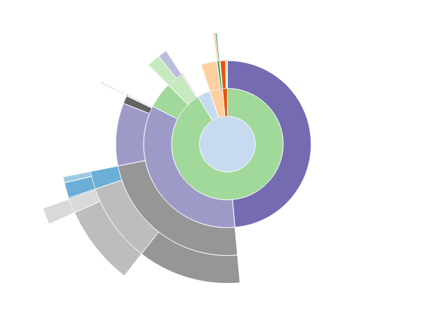
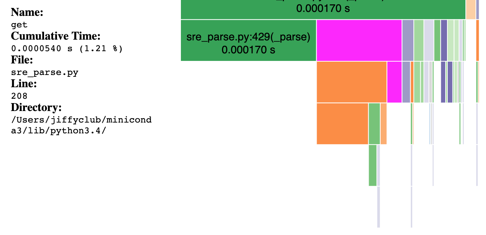
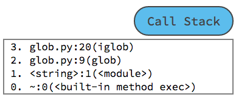
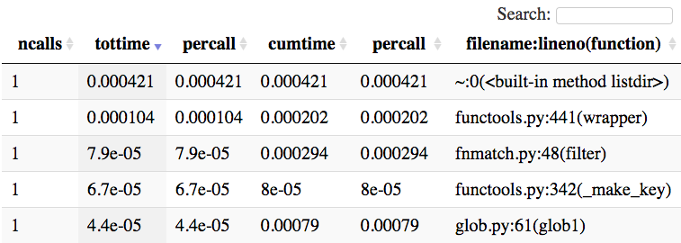
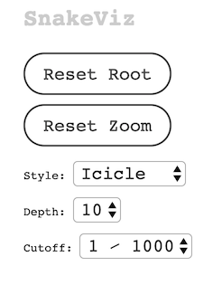

# SnakeViz

SnakeViz is a browser based graphical viewer for the output of Python's
[cProfile][] module.
It was originally inspired by [RunSnakeRun][].
SnakeViz works on Python 2.7 and Python 3.
SnakeViz itself is still likely to work on Python 2.6,
but official support has been dropped now that [Tornado][] no longer
supports Python 2.6.

## Installation

SnakeViz is available [on PyPI][pypi]. Install with [pip][]:

```
pip install snakeviz
```

## Starting SnakeViz

### Command Line Interface

If you have generated a profile file called `program.prof` you can start
SnakeViz from the command line:

```
snakeviz program.prof
```

Run `snakeviz --help` to see available options.

### IPython

SnakeViz includes IPython line and cell magics for going straight
from code to a visualization.
First load the magics:

```
%load_ext snakeviz
```

Then use the `%snakeviz` and `%%snakeviz` magics to profile and view
individual lines or entire blocks of code:

```
% snakeviz glob.glob('*.txt')
```

```
%%snakeviz
files = glob.glob('*.txt')
for file in files:
    with open(file) as f:
        print(hashlib.md5(f.read().encode('utf-8')).hexdigest())
```

Note: Using the IPython `%snakeviz` magics requires internet access.
If you are working offline, use [prun][] to save a profile file
and then start SnakeViz from the command line.

## Generating Profiles

### cProfile

You can use the [cProfile][] module at the command line to create a
profile file for a script:

```
python -m cProfile -o program.prof my_program.py
```

See the [user's manual][generating] for more info and other options.

### IPython

You can also generate profile files of specific code using
IPython's [prun][] magic using the `-D` flag:

```
%prun -D program.prof glob.glob('*.txt')
```

`prun` has both line and cell magics available,
see the [IPython docs][prun] for more information.

## Interpreting Results

### Sunburst



SnakeViz displays profiles as a sunburst in which functions are represented
as arcs.
A root function is a circle at the middle, with functions it calls around,
then the functions those functions call, and so on.
The amount of time spent inside a function is represented by
the angular width of the arc.
An arc that wraps most of the way around the circle represents a function
that is taking up most of the time of its calling function, while a
skinny arc represents a function that is using hardly any time at all.

Functions don't just spend time calling other functions, they also have their
own internal time. SnakeViz shows this by putting a special child on each node
that represents internal time. Only functions that call other functions will
have this, functions with no calls are entirely internal time.

### Function Info

Placing your cursor over an arc will highlight that arc and any other
visible instances of the same function call.
It will also display a list of information to the left of the sunburst.



The displayed information includes:

- **Name:** function name
- **Cumulative Time:** total cumulative amount of time spent in the function
    in seconds and as a percentage of the total program run time
- **File:** name of the file in which the function is defined
- **Line:** line number on which the function is defined
- **Directory:** directory of the file

Note: For some built-in functions the file name, line number, and
directory will be '~', 0, and blank, respectively.

### Zooming and Call Stack

Clicking on an arc will zoom the visualization, making that function
the new root and allowing you to magnify different parts of the profile.
Clicking the center of the sunburst will zoom out one level and clicking
the "Reset" button will return the visualization to its most zoomed-out
state.



To the right of the sunburst is a "Call Stack" button.
Clicking this will expand a list that shows all the functions
leading up to the current root of the sunburst, with the root function
at the bottom of the list.
The call stack can be useful for orienting yourself when you've zoomed
into the profile.
Click the "Call Stack" button again to hide the list.

### Stats Table

Below the sunburst visualization is a table of profile data similar to the
one you'd see working with Python's built-in [cProfile][] and [pstats][]
modules.



The table contains one row per unique function called.
Calls to the same function from different places are all grouped into
one row.
The columns are the same as described in the
[cProfile user's manual][generating]:

- **ncalls:** Total number of calls to the function.
    If there are two numbers, that means the function recursed and
    the first is the total number of calls
    and the second is the number of primitive (non-recursive) calls.
- **tottime:** Total time spent in the function,
    not including time spent in calls to sub-functions
- **percall:** `tottime` divided by `ncalls`
- **cumtime:** Cumulative time spent in this function and all sub-functions
- **percall:** `cumtime` divided by `ncalls`
- **filename:lineno(function):** File name and line number were the
    function is defined, and the function's name

The columns of the table are all sortable and the search box can be used
to filter the table based on the **filename:lineno(function)** column.

## Controls

SnakeViz has two controls that affect the visualization:
"depth" and "cutoff".
"Depth" controls how deep into the call stack the application goes when
building the graph.
Anything below this depth will not be shown until you zoom in by
clicking on a new function deeper in the call stack.
Increasing the displayed depth will show more of your profile at once,
but it can take longer to build and display the graph.



"Cutoff" controls the display of functions that take up very little
of their parents' cumulative time.
If a function's cumulative time divided by its parent's cumulative time
is less than the currently set cutoff, then that function will be displayed
but none of its sub-functions will be.
Setting a larger cutoff may display less of a profile,
but can speed up the building and rendering of the visualization.

## Notes

- SnakeViz currently only works with files produced by `cProfile`,
    it will not work with files from the `profile` module.
- SnakeViz will sometimes be unable to create a visualization and will
    show an error.
    This is usually because the visualization is too complex.
    You can make a simpler graph by increasing the cutoff, reducing the depth,
    or profiling a smaller subsection of your code.

## Contact

If you'd like to contribute to SnakeViz you can [fork it on GitHub][gh].
Please report issues on the [GitHub issue tracker][issues].

[cProfile]: https://docs.python.org/3.4/library/profile.html#module-cProfile
[RunSnakeRun]: http://www.vrplumber.com/programming/runsnakerun/
[Tornado]: http://www.tornadoweb.org/
[pypi]: https://pypi.python.org/pypi/snakeviz
[pip]: https://pip.pypa.io
[prun]: http://ipython.org/ipython-doc/2/api/generated/IPython.core.magics.execution.html#IPython.core.magics.execution.ExecutionMagics.prun
[generating]: https://docs.python.org/3.4/library/profile.html#instant-user-s-manual
[pstats]: https://docs.python.org/3.4/library/profile.html#pstats.Stats
[gh]: https://github.com/jiffyclub/snakeviz
[issues]: https://github.com/jiffyclub/snakeviz/issues
